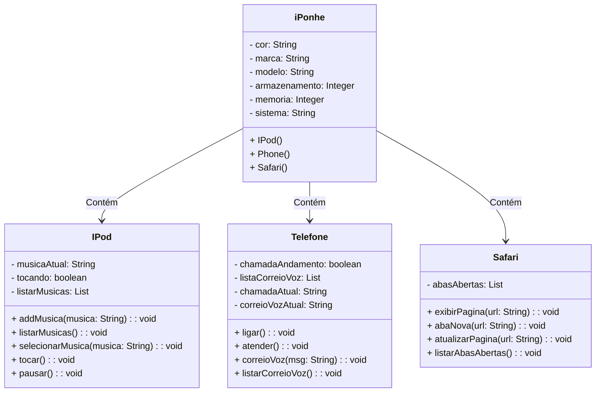

# Desafio DIO IPhone

## Diagrama

```mermaid
classDiagram
  class iPonhe {
    - cor: String
    - marca: String
    - modelo: String
    - armazenamento: Integer
    - memoria: Integer
    - sistema: String
    + IPod()
    + Phone()
    + Safari()
  }

  class IPod {
    - musicaAtual: String
    - tocando: boolean
    - listarMusicas: List<String>
    + addMusica(musica: String): void
    + listarMusicas(): void
    + selecionarMusica(musica: String): void
    + tocar(): void
    + pausar(): void
  }

  class Telefone {
    - chamadaAndamento: boolean
    - listaCorreioVoz: List<String>
    - chamadaAtual: String
    - correioVozAtual: String
    + ligar(): void
    + atender(): void
    + correioVoz(msg: String): void
    + listarCorreioVoz(): void
  }

  class Safari {
    - abasAbertas: List<String>
    + exibirPagina(url: String): void
    + abaNova(url: String): void
    + atualizarPagina(url: String): void
    + listarAbasAbertas(): void
  }

  iPonhe --> IPod: Contém
  iPonhe --> Telefone: Contém
  iPonhe --> Safari: Contém
```
